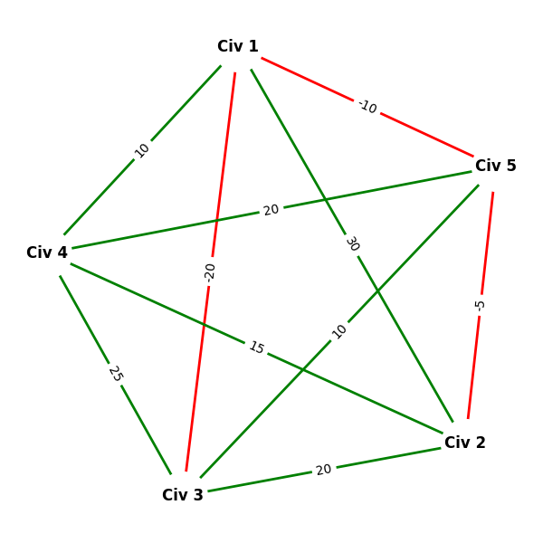
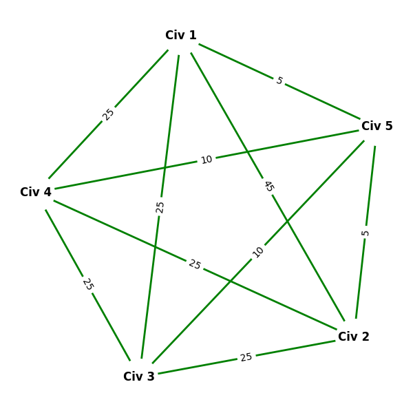

# Dialogue Among Civilizations

**Dialogue Among Civilizations** is an international relations theory introduced by Mohammad Khatami, former president of Iran. Its central idea is to promote universal dialogue between nations, aiming to transform conflicts into peaceful relations. (https://en.wikipedia.org/wiki/Dialogue_Among_Civilizations)

In this project, this concept is modeled as a **weighted complete graph**, where:

- **Vertices** represent civilizations or nations.
- **Edge weights** represent the relationship level between two civilizations:
  - **Positive values** indicate friendly relations.
  - **Negative values** indicate conflict.

The program’s goal is to find a **sequence of dialogues initiated by Civilization 1** with the other civilizations that transforms all relations into **positive values**, thus achieving universal peace.  
If no such sequence exists, the program states that **peace cannot be reached**.

---

## Python Requirements

Before compiling and running the program, make sure to install the required Python packages used for graph generation:

```bash
pip install -r requirements.txt
```

---

## How to Compile and Run

Make sure you are in the project’s root folder to execute the following commands.

### Compile

**Windows**
```bash
gcc main.c -o dialogue.exe
```

**Linux/macOS**
```bash
gcc main.c -o dialogue
```

### Run

**Windows**
```bash
./dialogue.exe
```

**Linux/macOS**
```bash
./dialogue
```

Ensure that the file **input.txt** is present in the same directory as the executable.

## Input Format

The `input.txt` file must contain:

1. The number of civilizations **N** (N ≤ 10).
2. An **N x N** matrix representing the relationships between civilizations.

### Rules

- The diagonal values must be `0`.
- Matrix must be **symmetric**.
- Values must be in the range `[-100, 100]`:
  - **Positive values** = friendly relations.
  - **Negative values** = conflicts.

---

### Example Input
```
5
0   30  -20   10  -10
30   0   20   15  -5
-20  20   0   25   10
10   15   25   0   20
-10  -5   10   20   0
```

## Output

- Displays the initial relations matrix.
- Processes the possible dialogue sequence.
- Shows whether peace is achieved or not.
- Generates two graph images:
  - **graph_initial.png** – initial relations.
  - **graph_final.png** – final relations after dialogue (the final graph is the same as the initial graph if peace is not achieved).

---

## Graph Visualization

The project includes **Python scripts** to visualize relationships as graphs:

- `gerar_grafo_inicial.py` generates the initial graph.
- `gerar_grafo_final.py` generates the final graph.

Graphs use:
- **Green edges** for friendly relations.
- **Red edges** for conflicts.
- Edge labels display the numerical relationship values.

### Example Output

```
Initial relations between civilizations (5 civilizations):
--------------------------------------------------------
    0    30   -20    10   -10 
   30     0    20    15    -5 
  -20    20     0    25    10 
   10    15    25     0    20 
  -10    -5    10    20     0 
--------------------------------------------------------

Graph saved as graph_initial.png

Processing dialogue sequences to check for possible peace...

====================
Peace achieved!
With a dialogue sequence (actions by Civilization 1): Civ 4 -> Civ 2
====================

Graph saved as graph_final.png
```
<p align="center">
  <strong>Initial Graph</strong><br>
  
</p>

<p align="center">
  <strong>Final Graph (Peace achieved)</strong><br>
  
</p>